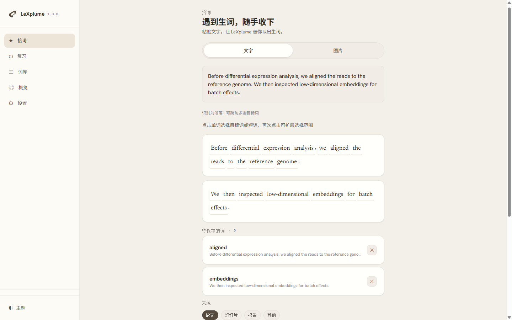
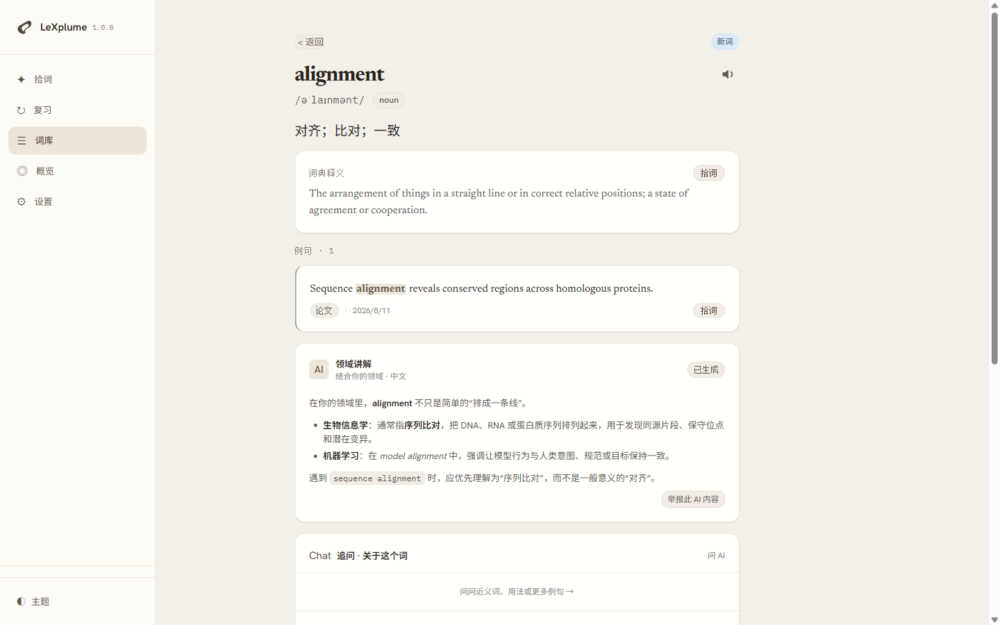
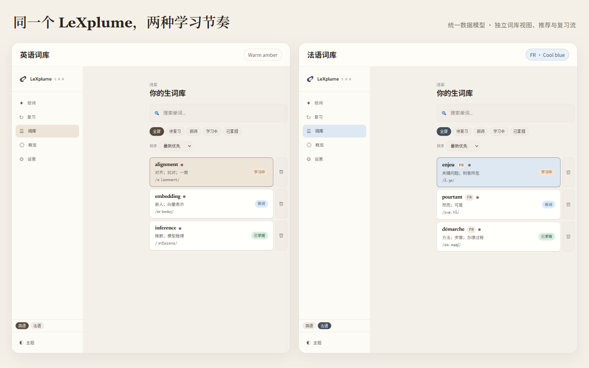

  

# LeXplume

## Turn the words you actually meet into words you can actually remember.

Capture vocabulary from papers, reports, slides, and everyday French. Understand it in your professional context, discover what to learn next from your own library, and let FSRS schedule the right review time.

> Capture the words you actually meet. Understand them in your domain. Remember them at the right time.

[简体中文](README.md) · [Français](README.fr.md)

[Live preview](https://lexplume.com) · [Product logic](PRODUCT.md) · [FAQ](FAQ.md) · [Support](mailto:support@lexplume.com) · [Privacy](https://lexplume.com/privacy)

> `lexplume.com` currently shows LeXplume 1.0.0. A free, invite-only release for independent adults aged 18+ is being prepared; public registration, payment, and a public Google Play release are not available yet.

_Captured from the live LeXplume 1.0.0 interface with fictitious demo data._

## Capture from your material, not somebody else's list

LeXplume starts with what you are already reading. Enter a word, paste a sentence or paragraph and select several targets, or extract text from an image with OCR. Each saved word can keep its sentence, source, tags, and capture time, so the vocabulary remains attached to the context that made it useful.

The flow is designed for papers, technical reports, lecture slides, and the French expressions encountered in everyday life.

## Not more definitions—definitions that relate to you

The same word can represent very different ideas across fields. Set a professional domain or identity and LeXplume can add an explanation framed for that context alongside the basic dictionary information.

Take `alignment`:

- In general usage, it can mean arrangement or agreement.
- In bioinformatics, it usually means **sequence alignment** across DNA, RNA, or proteins.
- In machine learning, `model alignment` concerns keeping model behaviour consistent with human intentions, norms, or goals.

The quick meaning, basic definition, and longer domain explanation remain separate. Domain explanations are cached after generation, so revisiting a word does not require another request.

## The longer your library grows, the more recommendations resemble you

Recommendations are not another fixed vocabulary list. LeXplume combines the active study language, your domain, a manually selected difficulty, recent captures, topic tags, and weak FSRS words to produce a mixed set of:

- adjacent concepts that extend topics you already study;
- useful collocations, derivatives, and word families;
- reinforcement for areas where recall is still weak.

Words already present in the active-language library are excluded. Recommendations remain temporary until you choose to add one through the normal capture flow. With a new or empty library, the system falls back to domain and difficulty.

## English and French, each with its own learning rhythm

English and French share one local data model and backup format, while keeping separate library views, recommendations, and review queues. French study uses a cool-blue ambience and visible `FR` markers; English keeps the warm-amber ambience and remains unmarked.

One review session covers one language, avoiding mixed English/French cards. Disabling French study hides French entries without deleting them.

_Side-by-side composition of two real interface states, both using fictitious data._

## Built for long-term memory, not one-time collection

Saving a word is only the beginning. LeXplume uses FSRS to schedule the next review from your feedback and supports flashcard, spelling, dictation, and sentence-input practice. The dashboard brings together due words, retention, streaks, activity, and vocabulary state so you can see whether collection is becoming memory.

| Capability | How LeXplume handles it |
| --- | --- |
| Capture | Words, sentences, paragraphs, and image/OCR input; select several targets at once |
| Understand | Pronunciation, dictionary definition, concise Chinese meaning, cached domain explanation, and per-word follow-up |
| Recommend | Uncaptured words selected from language, domain, difficulty, recent vocabulary, and weak areas |
| Review | FSRS scheduling with flashcard, spelling, dictation, and sentence-input modes |
| English / French | Separate library, recommendation, and review flows; blue French ambience with `FR` markers |
| Data | Browser-local storage, offline-capable core, and JSON export/import |
| Cloud | Optional account sync and bounded managed AI; local data remains the runtime source of truth |

## Local-first, with a clear AI-key boundary

- **Local by default.** Active vocabulary and review state live in the browser; core capture and review work offline.
- **Portable backup.** Data can be exported to and restored from JSON.
- **Browser-direct BYOK.** Choose an AI provider and model and supply your own key. The key stays on the device and is excluded from JSON export and sync.
- **Sync is optional.** Account sync is a cross-device mirror, not a replacement for local runtime data.
- **Managed AI is bounded.** Only eligible invited accounts may use a capped managed service, and it is never required for the core product.

Read the current [privacy policy](https://lexplume.com/privacy) before enabling optional AI features. Only content needed for the requested operation should be sent to an AI provider.

## Current availability

- The Web/PWA at [lexplume.com](https://lexplume.com) is the canonical product and currently presents LeXplume 1.0.0.
- Account and bounded managed-service foundations for the free invite-only release are still passing release gates; implemented code or documentation is not evidence of public activation.
- French AI enrichment has one known gap: it can fill part of speech, a French definition, and a concise Chinese meaning, but IPA request and persistence are not complete.
- Public registration, payment, and public Google Play distribution are not available. See [ROADMAP.md](ROADMAP.md) and [RELEASE_NOTES.md](RELEASE_NOTES.md).
- Mainland China is not an actively promoted or supported launch market at this stage.

## Design point of view

LeXplume uses a quiet **Paper** visual language: warm neutral surfaces, editorial typography, restrained hierarchy, and enough space to keep attention on the word and its sentence. The **Semantic Fold** mark combines one continuous form with one negative-space focus to represent language being captured, understood, and retained. It remains recognizable in one colour and at small sizes.

Read the full [product and design rationale](PRODUCT.md).

## Feedback and repository scope

Use the product-feedback issue form for non-private suggestions. Account-specific support belongs at [support@lexplume.com](mailto:support@lexplume.com), and security concerns must follow [SECURITY.md](SECURITY.md).

This is a public product-information repository containing release notes, support guidance, public product direction, and approved brand/media assets. It does not contain application source code; the source remains private. Publication does not grant a licence to the LeXplume application, name, visual identity, or private code.
