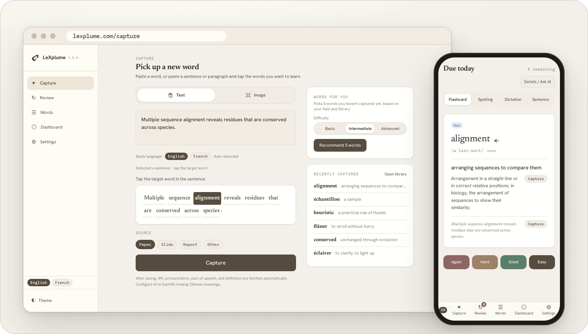
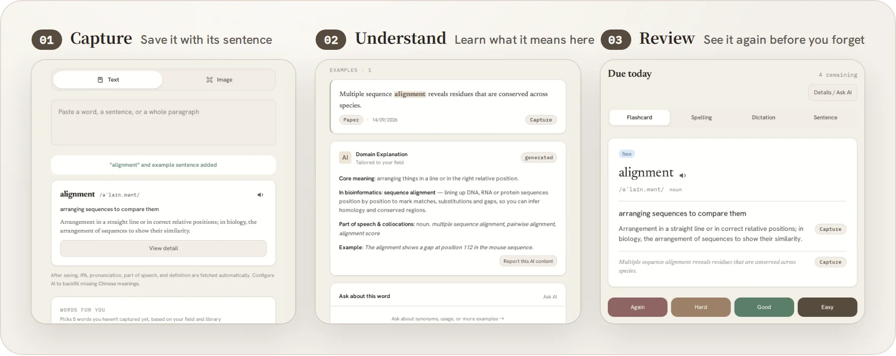
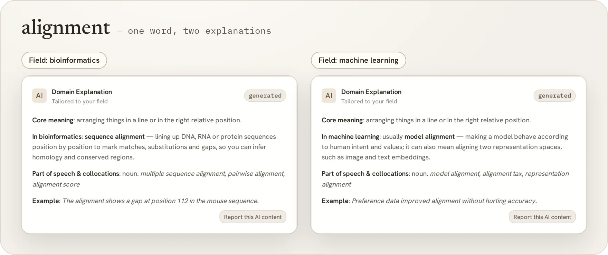
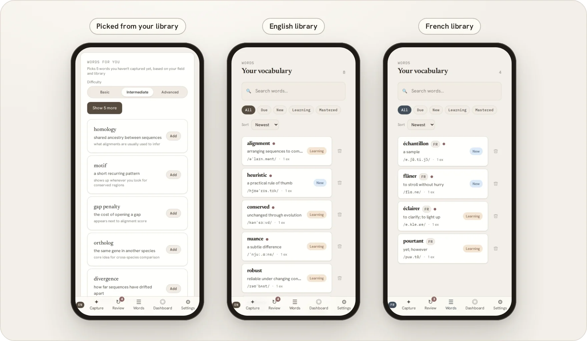

  

<h1 align="center">LeXplume</h1>

<strong>Des mots rencontrés aux mots retenus.</strong>

  Un mot inconnu dans un article ou un rapport ? Gardez-le avec sa phrase. 
  LeXplume l’explique pour votre domaine et laisse FSRS planifier les révisions. Pour l’anglais et le français.

  <a href="https://lexplume.com"><strong>Ouvrir l’application web</strong></a> ·
  <a href="https://lexplume.com/#early-access">Demander l’Early Access</a> ·
  <a href="FAQ.md">FAQ</a> ·
  <a href="README.md">简体中文</a> ·
  <a href="README.en.md">English</a>

<picture>
  <source media="(prefers-color-scheme: dark)" srcset="assets/readme/en/hero-dark.webp">
  
</picture>

Captures de l’interface réelle (en anglais) · données de démonstration

## Trois étapes, du mot inconnu au mot connu

1. **Capturer : avec sa phrase.** Collez un texte, ajoutez une capture d’écran ou une photo, puis touchez le mot à apprendre. La phrase et la source sont enregistrées avec lui ; l’API, la catégorie grammaticale et une définition se remplissent automatiquement.
2. **Comprendre : ce qu’il veut dire ici.** Au-delà de la définition du dictionnaire, l’IA tient compte de votre domaine et de la phrase d’origine pour expliquer le sens du mot dans votre texte. Vous pouvez ensuite poser une question de suivi.
3. **Réviser : juste avant d’oublier.** FSRS planifie chaque révision : mieux vous retenez un mot, plus l’intervalle s’allonge. En plus des cartes, il y a l’orthographe, la dictée et les phrases à compléter.

## Un même mot, un autre domaine, un autre sens

Indiquez votre domaine dans les réglages et les explications s’y adaptent. Le même `alignment` désigne l’**alignement de séquences** en bio-informatique et l’**alignement des modèles** en apprentissage automatique. Une explication générée est conservée et reste consultable hors connexion.

## Continuer à partir de votre vocabulaire

- **Les prochains mots, choisis d’après votre vocabulaire.** Selon votre domaine, les mots déjà enregistrés et ceux que vous oubliez, LeXplume propose 5 mots que vous n’avez pas encore, au niveau de base, intermédiaire ou avancé. Rien n’est ajouté avant que vous touchiez « Ajouter ».
- **L’anglais et le français, séparément.** Activez le français dans les réglages : chaque langue a son vocabulaire et sa file de révision, et les suggestions suivent la langue étudiée. Une séance de révision porte sur une seule langue ; désactiver le français masque les mots français sans les supprimer.

## Partout avec vous, vos données restent à vous

| Ce qui compte | Ce que fait LeXplume |
| --- | --- |
| **Capturer sur ordinateur, réviser sur téléphone** | L’application web fonctionne sur ordinateur et sur téléphone et peut être installée sur l’écran d’accueil. Les comptes Early Access se synchronisent entre appareils. |
| **Réviser hors connexion** | Une fois installée, la capture, le vocabulaire et la révision fonctionnent hors connexion. L’IA, la synchronisation et le dictionnaire en ligne ont besoin du réseau. |
| **Stocké sur votre appareil par défaut** | LeXplume est local-first : votre vocabulaire reste sur votre appareil et vous pouvez exporter une sauvegarde JSON à tout moment. |
| **Votre propre clé API** | Votre clé IA reste sur cet appareil ; elle n’est ni synchronisée ni exportée. En connexion directe, elle n’est envoyée qu’au fournisseur IA que vous choisissez. |
| **L’IA est facultative** | La capture, le vocabulaire et la révision fonctionnent sans IA. |

Consultez la [politique de confidentialité](https://lexplume.com/privacy) avant d’activer l’IA. Seul le contenu nécessaire à l’opération demandée lui est transmis.

## Early Access

Utilisable dès maintenant, et gratuit pendant l’Early Access. Les fonctions locales marchent sans compte ; les comptes Early Access ajoutent la synchronisation et l’IA cloud, avec une limite d’utilisation quotidienne.

- Les comptes sont pour l’instant sur invitation (invite-only) et réservés aux adultes (18+) qui apprennent à titre personnel.
- Pour demander un accès, laissez votre e-mail sur [lexplume.com](https://lexplume.com/#early-access). Une demande ne crée pas de compte.
- Il n’y a pas encore d’offre payante. Les tarifs après l’Early Access ne sont pas décidés ; la gratuité n’est donc pas garantie pour toujours.

## Où en est le projet

- L’application web sur [lexplume.com](https://lexplume.com) (1.0.0) est utilisable dès maintenant et peut être installée comme une application.
- L’application Android est en préparation et n’est pas encore sur le store. L’inscription publique et le paiement ne sont pas ouverts.
- Limite connue : pour les mots français, l’enrichissement IA remplit la catégorie grammaticale, la définition française et un sens chinois court, mais pas encore la transcription phonétique (API).
- LeXplume n’est actuellement ni promu ni pris en charge en Chine continentale.
- Voir [ROADMAP.md](ROADMAP.md) pour la suite et [RELEASE_NOTES.md](RELEASE_NOTES.md) pour les versions.

## En savoir plus

[Logique produit et design](PRODUCT.md) · [FAQ](FAQ.md) · [Confidentialité](https://lexplume.com/privacy) · [Assistance](SUPPORT.md) · [Sécurité](SECURITY.md) · [Retours](CONTRIBUTING.md)

## À propos de ce dépôt

Ce dépôt public d’information produit contient les notes produit, les notes de version, l’assistance et des captures approuvées. Il ne contient pas le code source de l’application, qui reste privé. Sa publication n’accorde aucune licence sur l’application, le nom, l’identité visuelle ou le code source de LeXplume ; voir [NOTICE.md](NOTICE.md).

Utilisez les formulaires d’issue pour les suggestions sans données personnelles. Les questions de compte vont à [support@lexplume.com](mailto:support@lexplume.com), et les problèmes de sécurité se signalent en privé selon [SECURITY.md](SECURITY.md).
