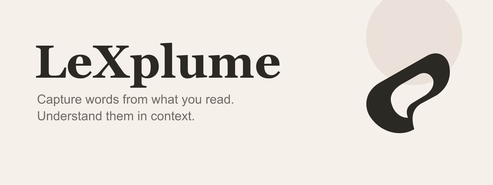
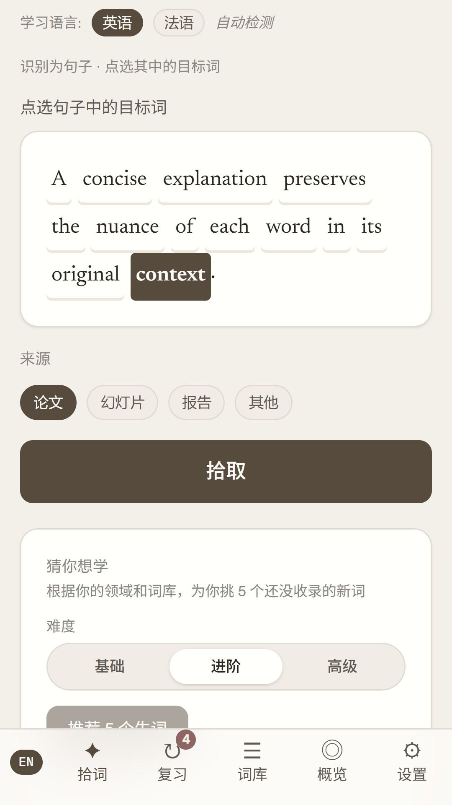
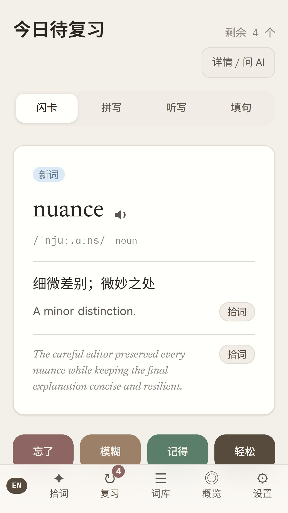
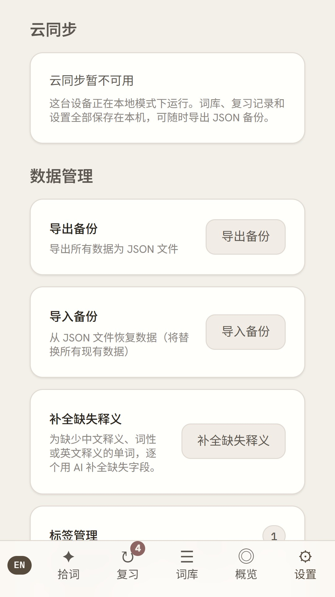

  

# LeXplume

**Transformez les mots rencontrés dans vos lectures en vocabulaire réellement mobilisable.**

[English](README.md) · [简体中文](README.zh-CN.md)

[Site](https://lexplume.com) · [Logique produit](PRODUCT.md) · [Assistance](mailto:support@lexplume.com) · [Confidentialité](https://lexplume.com/privacy)

LeXplume est une application de vocabulaire anglais et français destinée aux adultes autonomes, avec une interface pensée d'abord en chinois. Elle relie les mots rencontrés dans de vrais contenus, leur phrase d'origine, une explication concise et la révision FSRS, sans placer un compte cloud ou un abonnement IA au centre de l'expérience.

## Pourquoi LeXplume

- **Les listes génériques commencent en dehors de votre vie.** LeXplume part de ce que vous avez choisi de lire.
- **Une définition sans contexte s'oublie vite.** Chaque mot peut conserver la phrase qui lui donnait du sens.
- **Créer des cartes à la main interrompt la lecture.** Capture, compréhension et révision restent dans un même flux.
- **Une expérience uniquement cloud réduit le contrôle.** Le vocabulaire et les révisions sont local-first, utilisables hors connexion et sauvegardables en JSON.

## La boucle d'apprentissage

**Rencontrer → Capturer → Comprendre → Réviser → Retenir et réutiliser**

1. Rencontrer un mot anglais ou français utile dans une vraie lecture.
2. Capturer le mot ou l'expression avec sa phrase.
3. Le comprendre grâce au contexte lexical et à une aide IA facultative.
4. Le réviser lorsque FSRS estime que la mémoire doit être renforcée.
5. Le retenir et le réutiliser par le rappel, l'orthographe, la dictée et les phrases à compléter.

## Fonctions principales

- Capture depuis du texte ou du texte extrait d'une image, avec la phrase d'origine.
- Bibliothèque local-first avec export et restauration JSON.
- Révision FSRS par cartes, orthographe, dictée et phrases à compléter.
- Anglais par défaut et français facultatif.
- Langues de l'interface, des explications et des mots étudiés indépendantes.
- IA facultative avec une clé locale, ou service géré plafonné pour les comptes invités éligibles.
- Synchronisation facultative comme miroir cloud, jamais comme source d'exécution.

## Aperçu réel

Ces captures proviennent de l'interface locale réelle de LeXplume avec des données d'apprentissage fictives.

| Capturer en contexte | Réviser avec FSRS | Garder le contrôle local |
| --- | --- | --- |
|  |  |  |

## Point de vue design

LeXplume adopte un langage visuel **Paper** calme : surfaces neutres et chaleureuses, typographie éditoriale, hiérarchie retenue et espace suffisant pour garder l'attention sur le mot et sa phrase. Le signe **Semantic Fold** associe une seule forme continue à un foyer en espace négatif pour représenter la capture, la compréhension et la mémorisation. Il reste lisible en une couleur et à petite taille.

Voir la [logique produit et design complète](PRODUCT.md).

## Disponibilité actuelle

LeXplume 1.0 est en préparation comme bêta gratuite sur invitation, réservée aux adultes autonomes de 18 ans et plus. L'inscription publique, le paiement et une version publique sur Google Play ne sont pas disponibles. La Chine continentale n'est pas un marché de lancement activement pris en charge.

Le Web/PWA sur [lexplume.com](https://lexplume.com) est le produit canonique. L'activité Web de confiance Android reste en test avant publication.

## Données et confidentialité

La copie active du vocabulaire et des révisions reste dans le navigateur. La synchronisation facultative est un miroir cloud. Une clé d'IA directe reste sur l'appareil et est exclue des sauvegardes et de la synchronisation. Consultez la [politique de confidentialité](https://lexplume.com/privacy) avant d'activer l'IA.

## Retours et portée du dépôt

Utilisez le formulaire d'issue pour les suggestions non privées. Les demandes liées à un compte vont à [support@lexplume.com](mailto:support@lexplume.com), et les vulnérabilités suivent [SECURITY.md](SECURITY.md).

Ce dépôt public d'information produit contient les notes de version, l'assistance, la direction publique et les médias de marque approuvés. Il ne contient pas le code source de l'application, qui reste privé. Sa publication n'accorde aucune licence sur l'application, le nom, l'identité visuelle ou le code privé LeXplume.
