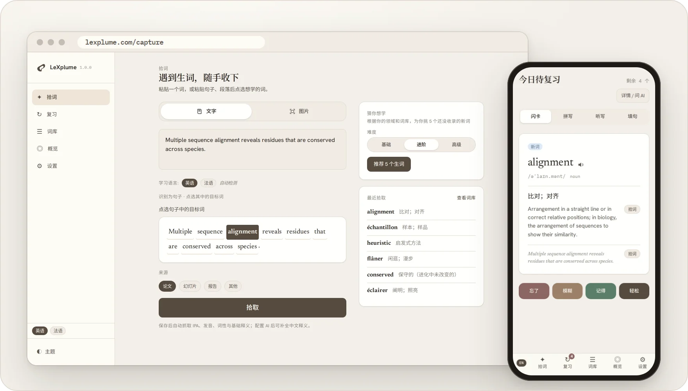
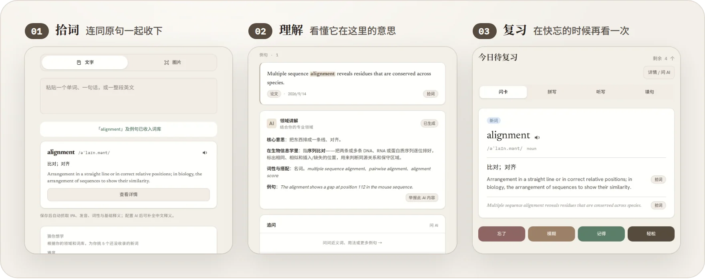
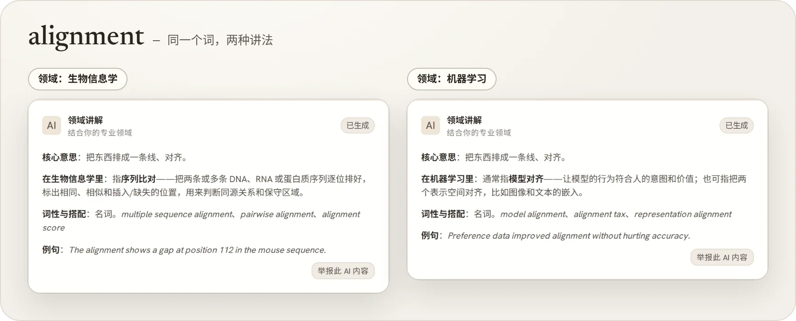
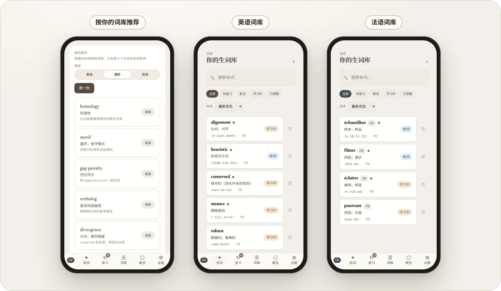

  

<h1 align="center">LeXplume</h1>

<strong>把遇到的生词，变成记得住的词。</strong>

  读论文、查资料时遇到生词，连同原句一起收下。 
  LeXplume 按你的专业领域讲清楚它的意思，复习时间交给 FSRS 安排。支持英语和法语。

  <a href="https://lexplume.com"><strong>打开网页版</strong></a> ·
  <a href="https://lexplume.com/#early-access">申请 Early Access</a> ·
  <a href="FAQ.md">常见问题</a> ·
  <a href="README.en.md">English</a> ·
  <a href="README.fr.md">Français</a>

<picture>
  <source media="(prefers-color-scheme: dark)" srcset="assets/readme/zh/hero-dark.webp">
  
</picture>

真实界面截图 · 演示数据

## 三步，把一个生词变成你的词

1. **拾词：连同原句一起收下。** 粘贴一段文字、截图或拍照，点一下要学的词。原句和来源会一起保存，音标、词性和释义自动补全。
2. **理解：看懂它在这里的意思。** 词典释义之外，AI 会结合你的专业领域和原句，讲清楚这个词在你的材料里指什么。还没懂可以接着追问。
3. **复习：在快忘的时候再看一次。** 复习时间由 FSRS 算法安排：记得越牢，间隔越长。除了闪卡，还有拼写、听写和填句三种练习。

## 同一个词，换个领域就是另一个意思

在设置里写下你的专业领域，领域讲解就按它来解释。同一个 `alignment`，在生物信息学里是**序列比对**，在机器学习里是**模型对齐**。讲解生成一次后会保存下来，之后离线也能看。

## 围绕你的词库，继续学下去

- **按词库推荐下一批词。** 参考你的领域、已经收下的词和最近记不牢的词，一次推荐 5 个还没收录的词，可以选基础、进阶、高级三档难度。点「收录」才会进入词库。
- **英语和法语，分开学。** 在设置里打开法语后，两种语言各有自己的词库和复习队列，推荐也跟着当前语言走。一次复习只练一种语言；关掉法语只会隐藏法语词，不会删除。

## 在哪都能用，数据留在你手里

| | |
| --- | --- |
| **电脑拾词，手机复习** | 网页版在电脑和手机上都能用，也可以安装到手机桌面。Early Access 账号可以在多台设备间同步。 |
| **离线也能复习** | 安装后，拾词、词库和复习都能离线使用。AI、同步和在线词典需要联网。 |
| **数据默认存在本机** | 本地优先（local-first）：词库保存在你的设备上，随时可以导出 JSON 备份。 |
| **自带 API Key** | 你自己的 AI 密钥只存在本机，不会同步，也不会写进导出文件；浏览器直连时只发给你选择的 AI 服务商。 |
| **AI 不是必需的** | 不用 AI 也可以拾词、管理词库和复习。 |

启用 AI 功能前，请阅读[隐私政策](https://lexplume.com/privacy)。AI 只会收到完成当前操作所需的内容。

## Early Access

现在就能用，Early Access 期间免费。不注册也能使用本地功能；Early Access 账号额外提供云同步和云端 AI，云端 AI 每天有使用上限。

- 账号目前采用邀请制（invite-only），仅限年满 18 岁（18+）的个人学习者。
- 在 [lexplume.com](https://lexplume.com/#early-access) 留下邮箱即可申请，提交申请不会创建账号。
- 目前没有付费套餐。之后如何定价还没有确定，所以不承诺永久免费。

## 现在的状态

- 网页版 [lexplume.com](https://lexplume.com) 1.0.0 可以直接使用，也可以安装成应用。
- Android 版还在准备中，尚未上架。公开注册和付费尚未开放。
- 已知问题：法语词的 AI 补全能生成词性、法语释义和中文短释义，但还不能生成音标（IPA）。
- 目前不在中国大陆推广，也不提供针对中国大陆的支持。
- 后续方向见 [ROADMAP.md](ROADMAP.md)，版本记录见 [RELEASE_NOTES.md](RELEASE_NOTES.md)。

## 更多

[产品与设计逻辑](PRODUCT.md) · [常见问题](FAQ.md) · [隐私政策](https://lexplume.com/privacy) · [支持](SUPPORT.md) · [安全问题](SECURITY.md) · [反馈方式](CONTRIBUTING.md)

## 关于这个仓库

这是 LeXplume 的公开产品信息仓库，包含产品说明、发布说明、支持资料和获批的截图素材。它不包含应用源代码，源代码保持私有（private）。公开这些文件不授予 LeXplume 应用、名称、视觉资产或源代码的使用许可，详见 [NOTICE.md](NOTICE.md)。

不涉及个人信息的产品建议，可以用 Issue 表单提交；账号问题请发邮件到 [support@lexplume.com](mailto:support@lexplume.com)；安全问题请按 [SECURITY.md](SECURITY.md) 私下报告。
